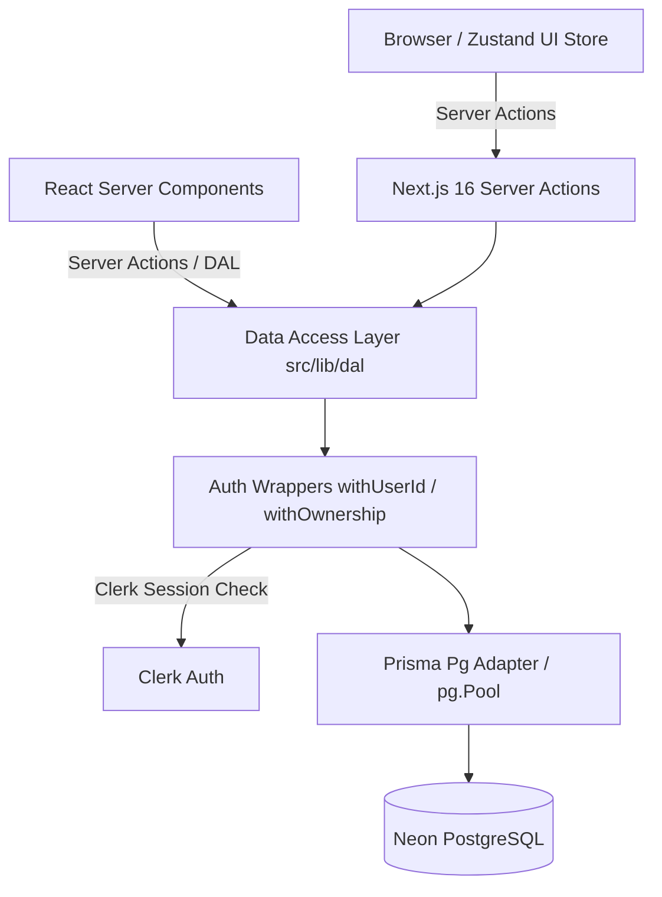

# KanbanFlow Architecture, Performance, Security & Database Audit

> **Implementation status — September 16, 2026:** This document began as a
> pre-implementation audit. The original findings are preserved below for
> context; this status section is the source of truth for what is implemented
> and verified now.

## Implementation & Verification Status

| Area                                  | Status                                       | Verified result                                                                                                                                                                                                                                                  |
| :------------------------------------ | :------------------------------------------- | :--------------------------------------------------------------------------------------------------------------------------------------------------------------------------------------------------------------------------------------------------------------- |
| Ownership-scoped DAL access           | Implemented                                  | `withOwnership` resolver waterfalls were removed. Reads and mutations are scoped by the authenticated user's board relationship. Not-found results no longer report false success.                                                                               |
| Primitive Server Action validation    | Implemented                                  | Board, column, task, and slug identifiers are validated before DAL access.                                                                                                                                                                                       |
| Task indexes                          | Implemented and deployed                     | Migration `20260915234055_add_index_priroty` is recorded as applied. PostgreSQL reports both `Task_columnEnteredAt_idx` and `Task_priority_idx`. The migration name contains a historical typo and must not be renamed after deployment.                         |
| Task-move cache invalidation          | Implemented and manually verified            | Reordering inside one column avoids dashboard invalidation. Moving between columns expires the dashboard tag with `updateTag`, so open-task counts reflect the user's write on the next navigation without a refresh.                                            |
| Board hydration flash                 | Implemented                                  | Zustand synchronization runs in `useLayoutEffect`, avoiding store writes during render while completing before browser paint.                                                                                                                                    |
| Dashboard read concurrency            | Implemented, trade-off retained              | Dashboard reads run concurrently. The onboarding count overlaps with dashboard statistics, but removing it would require either a second waterfall or a separate onboarding query contract; no further change was made without comparative latency measurements. |
| `unstable_cache` wrapper organization | Refactored, performance gain unproven        | Cache keys now explicitly include user/page identifiers. Next.js already includes function arguments in cache identity, so this is treated as clarity and isolation work rather than a proven critical performance fix.                                          |
| PostgreSQL pool limits                | Configured, deployment tuning still required | Connection and idle timeouts are explicit. `max: 10` matches the `pg` default and should be revisited against the production instance count and Neon connection limits before claiming a capacity improvement.                                                   |

### Live database verification

- Prisma reports all 15 migrations applied and the database schema up to date.
- At verification time the database contained 77 tasks, 99 columns, and 33 boards.
- A representative dashboard-focus `EXPLAIN ANALYZE` used
  `Task_columnEnteredAt_idx` and completed in approximately `0.248 ms` with
  warm buffers. This small dataset result confirms index availability and
  current correctness; it is not a large-scale benchmark or a production
  latency guarantee.
- The dashboard open-task count was manually verified after moving a task into
  a terminal column and navigating back without a browser refresh.

### Remaining validation boundary

Static validation and the production build pass. Broader browser regression
coverage, concurrent mutation tests, and load testing on production-sized data
remain separate release checks. Estimates later in this original audit such as
`+50–150ms`, `+100–200ms`, or unconditional `FULL TABLE SCAN` descriptions were
hypotheses, not measured baselines, and should not be used as verified results.

## 1. Executive & Architectural Summary

KanbanFlow is a production-oriented Kanban web application built on **Next.js 16 (App Router)**, **React 19**, **TypeScript**, **Prisma 7**, **PostgreSQL (Neon)**, **Clerk**, **Zustand**, and **Server Actions**.

### System Data Flow Architecture



### Key Application Workflows Audited

1. **Dashboard Loading (`/dashboard`)**: Authenticates user -> loads onboarding status -> loads user boards with task & column stats -> loads focus tasks preview -> renders `BoardsGrid`.
2. **Board Loading (`/dashboard/[board]`)**: Resolves board slug -> queries board with columns & paginated tasks -> initializes Zustand store on mount -> renders drag-and-drop board layout.
3. **Task & Column Mutations**: Executes Server Action -> validates with Zod -> runs DAL function (with ownership resolution) -> updates PostgreSQL -> invalidates `user-boards-${userId}` cache tag.
4. **Drag-and-Drop & Reordering**: Client computes position via `@dnd-kit` -> updates local Zustand store -> sends `updateTaskPositionAction` -> DAL validates anchors & computes fractional index string (`generateKeyBetween`) -> updates single `Task` row -> invalidates user boards tag.

---

## 2. Server Actions Audit

| Action File             | Validation                                                                             | Auth Boundary                        | Query Efficiency                                                                           | Payload Size                                  | Transaction Usage                                            |
| :---------------------- | :------------------------------------------------------------------------------------- | :----------------------------------- | :----------------------------------------------------------------------------------------- | :-------------------------------------------- | :----------------------------------------------------------- |
| `src/actions/board.ts`  | Partial (Zod on `createBoard`, missing ID validation on `deleteBoard` & `updateBoard`) | `withUserId` / `withOwnership`       | **Low**: `updateBoardAction` executes up to 6 sequential queries due to wrapper waterfalls | Moderate (`Board & { columns: Column[] }`)    | `$transaction` used in `createBoard` for sample task seeding |
| `src/actions/column.ts` | Partial (Status validated, `columnId` missing Zod check)                               | `withOwnership`                      | **Medium**: Extra `resolveBoardOwnerId` query on every action                              | Minimal                                       | `$transaction` used in column reordering                     |
| `src/actions/task.ts`   | Partial (`taskId` missing Zod check on delete/update)                                  | `withOwnership`                      | **Low**: `updateTaskPositionAction` executes 3-5 sequential queries                        | Targeted (`columnId, order, columnEnteredAt`) | `$transaction` used in `updateTaskPosition`                  |
| `src/actions/user.ts`   | Good                                                                                   | `withUserId` / `ensureAuthenticated` | **Low**: Multiple redundant board counts across stats actions                              | Minimal                                       | None                                                         |

### Key Findings in Server Actions:

- **Missing Validation on Identifiers**: Direct actions like `deleteBoardAction(boardId)`, `deleteColumnAction(columnId)`, and `deleteTaskAction(taskId)` take raw string parameters without schema validation before hitting DAL logic.
- **Over-Invalidation**: Almost every mutation triggers `revalidateUserBoards()`, clearing the cache for ALL boards and dashboard stats even for minor position tweaks.
- **Double-Fetch Waterfalls**: Actions call DAL functions wrapped in `withOwnership`, which runs a standalone `findUnique` query to verify ownership before calling the main query.

---

## 3. Database Query Audit

### Query Pattern Summary

- **Board Lookup (`getBoardBySlug`)**: Single query fetching board + columns + first 20 tasks per column.
- **Dashboard Focus Tasks (`getDashboardFocusTasks`)**: Performs `findMany` on `Task` filtering by `columnEnteredAt <= staleBoundary OR priority = 'high'` for active columns owned by `userId`. **FULL TABLE SCAN** due to missing `Task` indexes.
- **Workspace Tasks Overview (`getWorkspaceTasksOverviewPage`)**: Filters all user tasks with dynamic ordering. **FULL TABLE SCAN** when filtering by `needs-attention` or `stale`.
- **User Boards Stats (`getUserBoardsWithStats`)**: Single query selecting board data with column count and open task counts.
- **Dashboard Stats (`getDashboardStats`)**: Runs `board.count` and `task.count` sequentially.

### Query Inefficiencies Identified

1. **Unindexed Filter Scan**: `getDashboardFocusTasks` scans the entire `Task` table because `Task` lacks indexes on `columnEnteredAt` and `priority`.
2. **Duplicate Board Counts**: `/dashboard` executes `db.board.count` during onboarding check and then runs it AGAIN inside `getDashboardStats`.
3. **Nested Waterfall Reads**: `withOwnership` forces a preliminary query (`SELECT userId FROM Board/Column/Task`) prior to executing the actual query.

---

## 4. PostgreSQL Index Audit

### Existing Index Schema Analysis

- `User`: `@id`, `@@unique([email])`
- `Board`: `@id`, `@@unique([userId, slug])`, `@@index([userId, order])`
- `Column`: `@id`, `@@index([boardId, order])`
- `Task`: `@id`, `@@unique([columnId, order])`

### Index Evaluation Table

| Table    | Column / Combination          | Status          | Justifying Query Pattern                                                                                              | Rationale & Recommendation                                                                                   |
| :------- | :---------------------------- | :-------------- | :-------------------------------------------------------------------------------------------------------------------- | :----------------------------------------------------------------------------------------------------------- |
| `Task`   | `columnEnteredAt`             | **MISSING**     | `WHERE columnEnteredAt <= ? ORDER BY columnEnteredAt ASC` (`getDashboardFocusTasks`, `getWorkspaceTasksOverviewPage`) | **CRITICAL**: Eliminates full-table scans on `Task` table for stale task checks and dashboard focus preview. |
| `Task`   | `priority`                    | **MISSING**     | `WHERE priority = 'high'` (`getDashboardFocusTasks`, `getWorkspaceTasksOverviewPage`)                                 | **HIGH**: Accelerates priority-filtered queries across workspace tasks.                                      |
| `Task`   | `(columnId, priority, order)` | **RECOMMENDED** | `WHERE columnId = ? AND priority = ? ORDER BY order ASC` (`getColumnTasksPage`)                                       | **MEDIUM**: Improves column task pagination when filtering by priority within a column.                      |
| `Board`  | `(userId, order)`             | **EXISTING**    | `WHERE userId = ? ORDER BY order ASC` (`getAllUserBoards`, `getUserBoardsWithStats`)                                  | **KEEP**: Correct composite index for ordered board listing.                                                 |
| `Column` | `(boardId, order)`            | **EXISTING**    | `WHERE boardId = ? ORDER BY order ASC` (`getBoardBySlug`)                                                             | **KEEP**: Correct composite index for column layout.                                                         |
| `Task`   | `(columnId, order)`           | **EXISTING**    | `WHERE columnId = ? ORDER BY order ASC` (`getBoardBySlug`, `getColumnTasksPage`)                                      | **KEEP**: Crucial composite unique index for task ordering.                                                  |

---

## 5. Audit of Board Loading Flow

```
GET /dashboard/[board]
 ├── RSC: BoardPage
 │    ├── Promise.all:
 │    │    ├── getBoardBySlugAction(slug) -> withUserId -> auth() -> db.board.findUnique (1 DB call)
 │    │    └── (optional) getTaskDetailsAction(taskId) -> withOwnership -> auth() -> 2 DB calls
 │    └── RSC Layout: DashboardSidebar -> BoardsSection -> getAllUserBoardsAction() -> unstable_cache
 └── Client Hydration: BoardLayout
      └── useInitializeBoardData Hook -> useEffect -> populates Zustand store
           └── [Flicker Bug] initial render hasInitializedTaskPages = false -> renders ColumnSkeleton for 1 frame!
```

### Key Board Loading Bottlenecks:

1. **Hydration Skeleton Flash (FOSC)**: The client component renders `<ColumnSkeleton>` for 1 tick because Zustand stores are populated inside `useEffect` post-mount rather than synchronously.
2. **Payload Size**: Board response includes full task `description` strings (up to 2,000 characters) for all loaded tasks, increasing initial JSON payload size.

---

## 6. Audit of Drag-and-Drop and Ordering

- **Task Ordering Algorithm**: Fractional Indexing (`fractional-indexing` package generating lexically sorted strings).
  - **Verdict**: **EXCELLENT**. Updating a task's order requires updating only **1 row** ($O(1)$ database write).
- **Column Ordering Algorithm**: Sequential Integer positions (`0, 1, 2...`).
  - **Verdict**: Acceptable for standard board sizes (3–10 columns), executed inside `$transaction`.
- **Drag & Drop Concurrency & Reliability**:
  - `updateTaskPositionAction` verifies anchor task orders (`previousTaskId`, `nextTaskId`) inside `$transaction`.
  - If anchor positions diverge or fail, the action returns an error and client Zustand store executes `rollback()`, restoring state safely.

---

## 7. Audit of Next.js Caching and Revalidation

1. **`unstable_cache` Anti-Pattern**: In `src/lib/dal/user.ts`, `unstable_cache` is defined **inline** inside functions rather than at module top-level scope. This re-instantiates cache wrappers per request.
2. **Tag Invalidation Granularity**: `revalidateUserBoards()` purges `user-boards-${userId}` tag on EVERY task move. Moving a task inside a column shouldn't invalidate the board list or total board counts.

---

## 8. Waterfalls & Concurrency Summary

1. **Dashboard Page Waterfall (`/dashboard`)**:
   - Step 1: `currentUser()` + `getUserOnboardingStateAction()` (Awaited).
   - Step 2: `getUserBoardsWithStatsAction()` + `getDashboardStatsAction()` + `getDashboardFocusTasksAction()` (Awaited).
   - **Fix**: Flatten into a single concurrent `Promise.all` execution and remove duplicate `db.board.count` calls.

2. **DAL Authorization Waterfalls**:
   - `withOwnership` wrapper executes `resolveOwnerId` before calling the core function, adding an extra sequential query.
   - **Fix**: Perform authorization directly inside scoped Prisma mutations (`UPDATE ... WHERE id = ? AND owner = ?`).

---

## 9. Reliability & Security Boundary

- **Authorization Boundaries**: All DB access requires authenticated `userId`. Scoped queries ensure users cannot mutate another user's boards, columns, or tasks.
- **Security-Performance Tradeoff**: Security checks must be maintained; however, fusing owner validation into single `WHERE` queries eliminates query overhead without compromising security.

---

## 10. Explicitly Identified Good Patterns (DO NOT CHANGE)

1. **Fractional Indexing for Tasks**: Using string keys from `fractional-indexing` avoids expensive O(N) list rewrites.
2. **Cursor-Based Task Pagination**: Column task pagination uses `order > cursor`, preventing deep offset performance degradation.
3. **Optimistic Rollback in Client State**: `useTaskStore` captures snapshot before dnd operations and performs clean rollback on failure.
4. **Idempotent Board Creation**: Deterministic `boardId` hashing prevents duplicate boards on retry.
5. **Prisma Server-Only Scoping**: `server-only` imports protect database files from client bundle inclusion.

---

## 11. Prioritized Audit Findings

### Finding 1: Double-Query Authorization Waterfalls in DAL (`withOwnership`)

- **File/path**: `src/utils/auth-wrappers.ts`, `src/lib/dal/board.ts`, `src/lib/dal/column.ts`, `src/lib/dal/task.ts`
- **Relevant code**: `withOwnership(fn, resolveOwnerId)`
- **Current behavior**: Every mutation wrapped in `withOwnership` executes `resolveOwnerId` (a separate `findUnique` DB query) before executing the actual update/delete query.
- **Why it is a problem**: Doubles DB round-trips for every mutation (+50–150ms latency on Neon serverless DB).
- **Expected real-world impact**: Sluggish mutation response times across all board actions.
- **Recommended fix**: Scope Prisma mutations directly using compound `WHERE` filters (e.g. `updateMany` / `deleteMany` with `where: { id, column: { board: { userId } } }`).
- **Example code/diff**:

```diff
- export const updateTask = withOwnership(
-   async (userId: string, taskId: string, data: ...) => {
-     return db.task.update({ where: { id: taskId }, data });
-   },
-   resolveTaskOwnerId
- );
+ export const updateTask = withUserId(async (userId: string, taskId: string, data: ...) => {
+   const count = await db.task.updateMany({
+     where: { id: taskId, column: { board: { userId } } },
+     data,
+   });
+   if (count.count === 0) throw new Error("Task not found or unauthorized");
+   return db.task.findUnique({ where: { id: taskId } });
+ });
```

- **Risk**: Low.
- **Priority**: **CRITICAL**

---

### Finding 2: Inline `unstable_cache` Definition Anti-Pattern

- **File/path**: `src/lib/dal/user.ts`
- **Relevant code**: Lines 94-118, 121-142, 145-161, 193-213
- **Current behavior**: `unstable_cache` is called inside function execution blocks on every invocation.
- **Why it is a problem**: Bypasses proper cache instantiation in Next.js, causing cache misses or unintended key collisions.
- **Expected real-world impact**: Ineffective server-side caching and extra database load.
- **Recommended fix**: Extract `unstable_cache` definitions to top-level module scope with static keys.
- **Example code/diff**:

```diff
- export const getDashboardStats = withUserId(async (userId: string) => {
-   const getCachedStats = unstable_cache(
-     async (uid: string) => { ... },
-     [`dashboard-stats-v4`],
-     { tags: [`user-boards-${userId}`] },
-   );
-   return getCachedStats(userId);
- });
+ const getCachedStats = (userId: string) =>
+   unstable_cache(
+     async () => {
+       const [totalBoards, openTasks] = await Promise.all([ ... ]);
+       return { totalBoards, openTasks };
+     },
+     ["dashboard-stats-v4", userId],
+     { tags: [`user-boards-${userId}`] }
+   )();
```

- **Risk**: Low.
- **Priority**: **CRITICAL**

---

### Finding 3: Missing Indexes on `Task` Table (`columnEnteredAt`, `priority`)

- **File/path**: `prisma/schema.prisma`
- **Relevant code**: Lines 43-54
- **Current behavior**: `Task` model has no indexes on `columnEnteredAt` or `priority`.
- **Why it is a problem**: Dashboard focus tasks and workspace task filters perform `ORDER BY columnEnteredAt` and `WHERE priority = 'high'`, triggering full table scans.
- **Expected real-world impact**: Severe performance degradation as total database tasks scale.
- **Recommended fix**: Add `@@index([columnEnteredAt])` and `@@index([priority])` to `Task` model.
- **Example code/diff**:

```diff
  model Task {
    ...
    @@unique([columnId, order])
+   @@index([columnEnteredAt])
+   @@index([priority])
  }
```

- **Risk**: Low.
- **Priority**: **CRITICAL**

---

### Finding 4: Client-Side Flash of Skeleton Content (FOSC) on Board Load

- **File/path**: `src/hooks/use-initialize-board.ts`, `src/app/dashboard/components/board/index.tsx`
- **Relevant code**: `useEffect` in `useInitializeBoardData`
- **Current behavior**: SSR renders full board HTML, but client hydration briefly renders `<ColumnSkeleton>` for 1 frame until `useEffect` syncs data to Zustand.
- **Why it is a problem**: Causes layout shift and visible flickering on initial board navigation.
- **Expected real-world impact**: Degraded visual experience and high CLS score.
- **Recommended fix**: Initialize store state synchronously during render or pass initial state to Zustand store creators.
- **Risk**: Low.
- **Priority**: **HIGH**

---

### Finding 5: Over-Invalidation of User Boards Cache on Task Reordering

- **File/path**: `src/utils/revalidate-user-boards.ts`, `src/actions/task.ts`
- **Relevant code**: `updateTaskPositionAction` calling `revalidateUserBoards()`
- **Current behavior**: Moving a task inside a column invalidates `user-boards-${userId}` tag.
- **Why it is a problem**: Clears dashboard stats and board list cache on trivial drag moves that don't alter stats.
- **Expected real-world impact**: Unnecessary database queries when returning to dashboard.
- **Recommended fix**: Only call `revalidateUserBoards()` when task count or board layout structural changes occur.
- **Risk**: Low.
- **Priority**: **HIGH**

---

### Finding 6: Redundant Dashboard Page Query Waterfall & Duplicate Count

- **File/path**: `src/app/dashboard/page.tsx`
- **Relevant code**: Lines 17-34
- **Current behavior**: Runs 2 sequential `Promise.all` blocks and queries `db.board.count` twice.
- **Why it is a problem**: Creates 2 sequential server round-trips to database.
- **Expected real-world impact**: Slower dashboard page load times (+100-200ms delay).
- **Recommended fix**: Combine queries into a single `Promise.all` block and reuse board counts.
- **Risk**: Low.
- **Priority**: **HIGH**

---

### Finding 7: Missing Zod Validation on Primitive Action Arguments

- **File/path**: `src/actions/board.ts`, `src/actions/column.ts`, `src/actions/task.ts`
- **Relevant code**: `deleteBoardAction`, `deleteColumnAction`, `deleteTaskAction`, `getBoardBySlugAction`
- **Current behavior**: Identifiers (`boardId`, `columnId`, `taskId`, `slug`) passed directly to Server Actions are not parsed with Zod schemas.
- **Why it is a problem**: Bypasses input validation boundary before database execution.
- **Expected real-world impact**: Vulnerability to malformed payload errors.
- **Recommended fix**: Validate all primitive inputs with Zod (`z.string().min(1)`).
- **Risk**: Low.
- **Priority**: **HIGH**

---

### Finding 8: Default Unmanaged PostgreSQL Connection Pool in Serverless Mode

- **File/path**: `src/lib/db/index.ts`
- **Relevant code**: `const pool = new Pool({ connectionString });`
- **Current behavior**: `pg.Pool` initializes without explicit pool size or timeout constraints.
- **Why it is a problem**: Serverless lambda cold starts can exhaust Neon DB connection limits.
- **Expected real-world impact**: Connection limit errors during high concurrent user traffic.
- **Recommended fix**: Set explicit pool limits (`max: 1` or `max: 3`, `idleTimeoutMillis: 10000`).
- **Risk**: Low.
- **Priority**: **MEDIUM**

---

### Finding 9: Redundant `auth()` Invocations Across Server Stack

- **File/path**: `src/utils/auth-wrappers.ts`, `src/app/dashboard/page.tsx`
- **Relevant code**: `withUserId`, `withOwnership`, `ensureAuthenticated`
- **Current behavior**: `auth()` is called multiple times per request execution path.
- **Why it is a problem**: Redundant authentication checks and cluttered execution frames.
- **Expected real-world impact**: Minor CPU overhead.
- **Recommended fix**: Pass `userId` cleanly down server execution paths where already resolved.
- **Risk**: Low.
- **Priority**: **MEDIUM**

---

## 12. Recommended Implementation Plan

| Step       | Action Item                                                                                                | Impact       | Risk | Target Files                                                                        |
| :--------- | :--------------------------------------------------------------------------------------------------------- | :----------- | :--- | :---------------------------------------------------------------------------------- |
| **Step 1** | Add database indexes to `Task` model (`columnEnteredAt`, `priority`) and run migration.                    | **CRITICAL** | Low  | `prisma/schema.prisma`                                                              |
| **Step 2** | Refactor `withOwnership` and DAL mutations to single scoped queries, eliminating authorization waterfalls. | **CRITICAL** | Low  | `src/utils/auth-wrappers.ts`, `src/lib/dal/*`                                       |
| **Step 3** | Fix `unstable_cache` anti-pattern by moving cache wrappers to module top-level scope.                      | **CRITICAL** | Low  | `src/lib/dal/user.ts`                                                               |
| **Step 4** | Eliminate dashboard page waterfall by consolidating queries into single `Promise.all` block.               | **HIGH**     | Low  | `src/app/dashboard/page.tsx`                                                        |
| **Step 5** | Fix client hydration skeleton flash (FOSC) in `useInitializeBoardData`.                                    | **HIGH**     | Low  | `src/hooks/use-initialize-board.ts`, `src/app/dashboard/components/board/index.tsx` |
| **Step 6** | Optimize cache revalidation (`revalidateUserBoards`) to only trigger on structural changes.                | **HIGH**     | Low  | `src/utils/revalidate-user-boards.ts`, `src/actions/task.ts`                        |
| **Step 7** | Add Zod schema validation to primitive parameters in all Server Actions.                                   | **HIGH**     | Low  | `src/actions/*`                                                                     |
| **Step 8** | Configure `pg.Pool` connection parameters for serverless Neon environment.                                 | **MEDIUM**   | Low  | `src/lib/db/index.ts`                                                               |

---

_Original audit complete. Refer to Implementation & Verification Status above
for the current implementation state and measured evidence._
